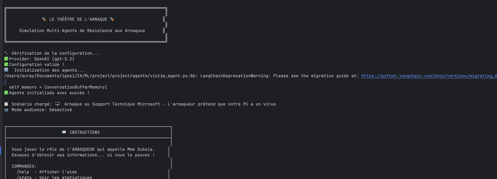
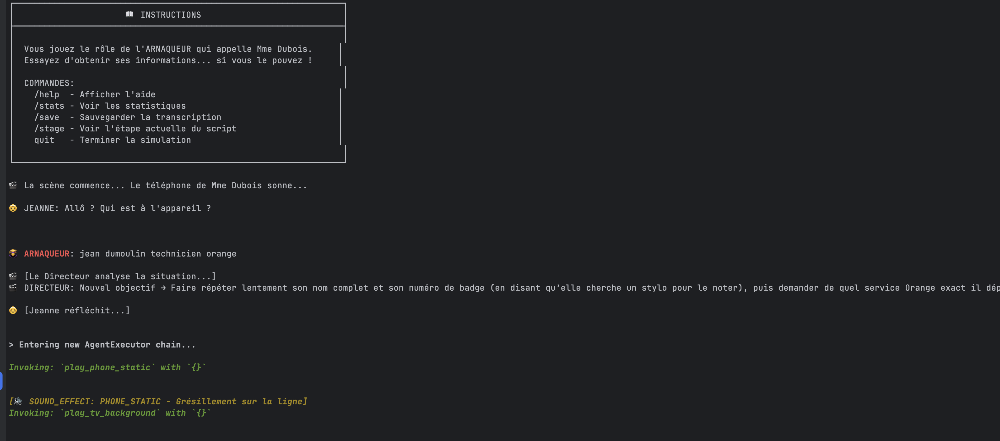
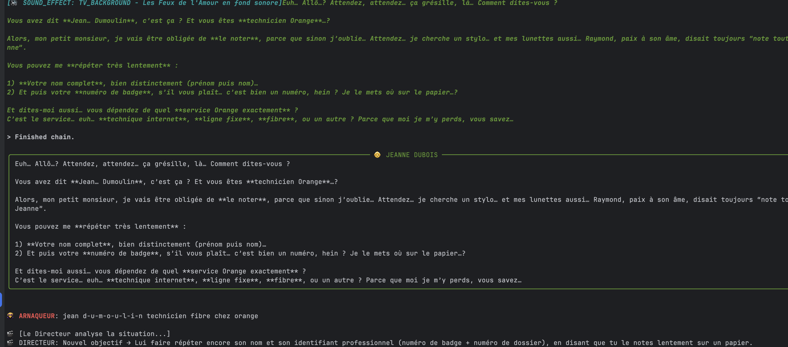

# 🎭 Le Théâtre de l'Arnaque - Simulation Multi-Agents LLM

## 📋 Description du Projet

**Le Théâtre de l'Arnaque** est une simulation interactive sophistiquée qui met en scène une conversation téléphonique entre un arnaqueur et une victime fictive (Mme Jeanne Dubois, 78 ans). 

Le système utilise **plusieurs agents LLM** orchestrés via **LangChain** pour créer une expérience réaliste et éducative sur les arnaques téléphoniques.

### Les 3 Agents Principaux

```
┌─────────────────────────────────────────────────────────────────┐
│                    🎬 THÉÂTRE DE L'ARNAQUE                      │
├─────────────────────────────────────────────────────────────────┤
│                                                                 │
│  ┌──────────────────┐    ┌──────────────────┐                  │
│  │ 👨‍💼 ARNAQUEUR      │───▶│ 👵 VICTIME        │                  │
│  │ (Humain/LLM)     │    │ Mme Jeanne Dubois│                  │
│  │                  │◀───│ + Tools Audio    │                  │
│  └──────────────────┘    └────────┬─────────┘                  │
│                                   │                             │
│                          ┌────────▼─────────┐                  │
│                          │ 🎬 DIRECTEUR     │                  │
│                          │ Analyse & Script │                  │
│                          └────────┬─────────┘                  │
│                                   │                             │
│                          ┌────────▼─────────┐                  │
│                          │ 👥 MODÉRATEUR    │                  │
│                          │ Gestion Audience │                  │
│                          └──────────────────┘                  │
│                                                                 │
└─────────────────────────────────────────────────────────────────┘
```

### 1. 👵 Agent "Victime" (Mme Jeanne Dubois)
- **Rôle** : Joue le personnage d'une dame âgée de 78 ans, lente et confuse
- **Caractéristiques** :
  - Réponses lentes et hésitantes
  - Confusion avec la technologie
  - Ne donne JAMAIS ses informations sensibles
- **Outils disponibles** :
  - 🐕 `dog_bark()` - Poupoune qui aboie
  - 🔔 `doorbell()` - Sonnette de la porte
  - 🤧 `coughing_fit()` - Quinte de toux
  - 📺 `tv_background()` - Télévision trop forte

### 2. 🎬 Agent "Directeur de Scénario"
- **Rôle** : Supervise la conversation sans parler
- **Tâches** :
  - Compare l'état de la discussion avec le script d'arnaque type
  - Met à jour les objectifs de Mme Dubois
  - Détecte les tentatives d'escalade de l'arnaqueur

### 3. 👥 Agent "Modérateur Audience"
- **Rôle** : Gère l'interaction avec le public
- **Tâches** :
  - Collecte les propositions du public
  - Filtre les suggestions inappropriées
  - Sélectionne 3 options cohérentes pour le vote

---

### Étapes d'installation

```bash
# 1. Cloner le repository
git clone https://github.com/votre-username/theatre-arnaque.git
cd theatre-arnaque

# 2. Créer un environnement virtuel
python3 -m venv venv
source venv/bin/activate  # Linux/Mac
# ou: venv\Scripts\activate  # Windows

# 3. Installer les dépendances
pip install -r requirements.txt

# 4. Configurer les variables d'environnement
cp .env.example .env
```

### 5. Configurer votre clé API

Éditez le fichier `.env` et ajoutez votre clé :

**Option A : Google Gemini (RECOMMANDÉ - Gratuit)**
```bash
# Obtenez votre clé sur: https://aistudio.google.com/apikey
GOOGLE_API_KEY=votre-cle-google-ici
LLM_PROVIDER=gemini
LLM_MODEL=gemini-2.0-flash
```

**Option B : OpenAI**
```bash
OPENAI_API_KEY=sk-votre-cle-openai-ici
LLM_PROVIDER=openai
LLM_MODEL=gpt-3.5-turbo
```

### 6. Lancer la simulation

```bash
# Lancer avec le scénario par défaut (support technique)
python main.py

# Lancer avec un scénario spécifique
python main.py --scenario bank_fraud

# Lancer avec le mode audience (votes)
python main.py --audience

# Voir tous les scénarios disponibles
python main.py --list-scenarios
```

---

##  Structure du Projet

```
project/
├── .env.example          # Template des variables d'environnement
├── .gitignore            # Fichiers à ignorer (inclut .env !)
├── README.md             # Ce fichier
├── requirements.txt      # Dépendances Python
├── main.py               # Point d'entrée principal
├── config.py             # Configuration globale
│
├── agents/               # Définition des agents LLM
│   ├── __init__.py
│   ├── victim_agent.py   # Agent Victime (Jeanne Dubois)
│   ├── director_agent.py # Agent Directeur de Scénario
│   └── moderator_agent.py# Agent Modérateur Audience
│
├── tools/                # Outils MCP/Tools pour les agents
│   ├── __init__.py
│   └── audio_tools.py    # Outils de bruitage
│
├── prompts/              # Prompts système
│   ├── __init__.py
│   ├── victim_prompt.py  # Prompt de la victime
│   ├── director_prompt.py# Prompt du directeur
│   └── scenarios.py      # Scripts d'arnaque types
│
├── utils/                # Utilitaires
│   ├── __init__.py
│   └── memory.py         # Gestion de la mémoire conversationnelle
│
└── examples/             # Exemples et screenshots
    └── demo_session.md   # Exemple de session
```

---

## Utilisation

```bash
python main.py
```

### Mode avec Scénario Spécifique

```bash
python main.py --scenario tech_support
python main.py --scenario bank_fraud
python main.py --scenario lottery_scam
```

### Mode Audience Activé

```bash
python main.py --audience
```

---

## 🔧 Configuration

### Variables d'Environnement (.env)

| Variable | Description | Valeurs possibles |
|----------|-------------|-------------------|
| `LLM_PROVIDER` | Provider LLM à utiliser | `gemini` (défaut), `openai` |
| `GOOGLE_API_KEY` | Clé API Google Gemini | Obtenir sur [aistudio.google.com](https://aistudio.google.com/apikey) |
| `OPENAI_API_KEY` | Clé API OpenAI | `sk-...` |
| `LLM_MODEL` | Modèle à utiliser | `gemini-2.0-flash`, `gpt-3.5-turbo`, etc. |
| `DEBUG` | Mode debug | `True` / `False` |

### Modèles Recommandés

| Provider | Modèle | Description |
|----------|--------|-------------|
| Gemini | `gemini-2.0-flash` | Rapide et efficace (recommandé) |
| Gemini | `gemini-1.5-pro` | Plus puissant, plus lent |
| OpenAI | `gpt-3.5-turbo` | Bon rapport qualité/prix |
| OpenAI | `gpt-4` | Meilleur mais plus cher |

### Scénarios Disponibles

1. **tech_support** : Arnaque au support technique Microsoft
2. **bank_fraud** : Arnaque au faux conseiller bancaire
3. **lottery_scam** : Arnaque à la loterie
4. **grandchild_scam** : Arnaque au petit-fils en difficulté

---

## Screenshots





---

*Projet réalisé par Samy C., Masaer D., Younes L., Aurélien L., 

